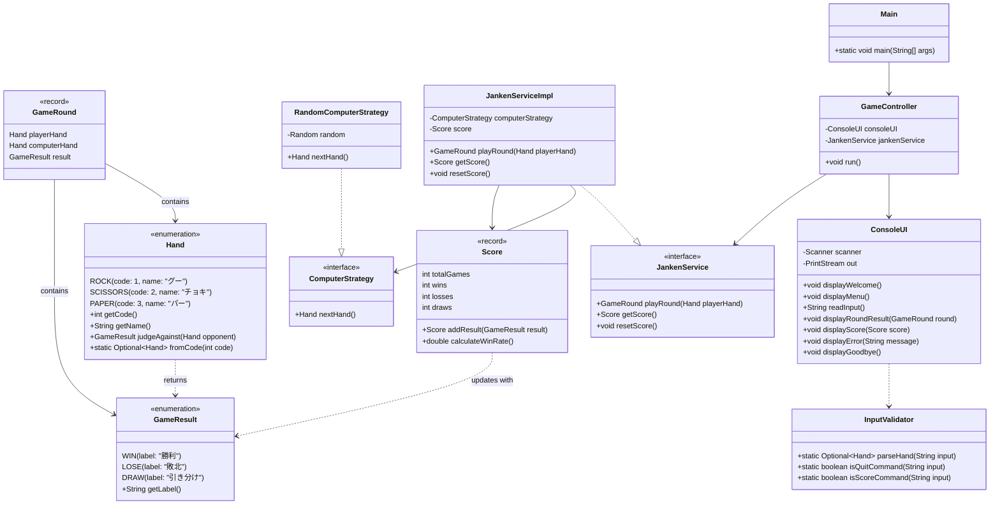
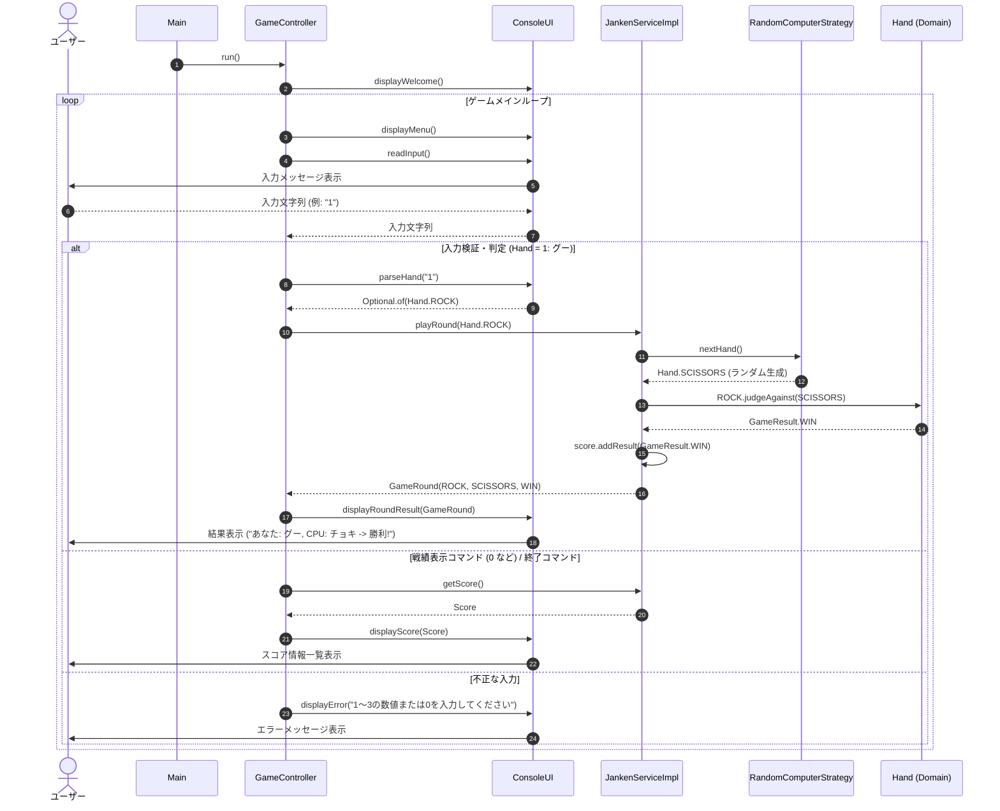

# 基本設計書: じゃんけんコンソールアプリ

- **対象ブランチ**: `feat/janken-console-app`
- **作成日**: 2026-08-09
- **作成者**: 2-code-architect
- **ステータス**: 基本設計完了

---

## 1. クラス設計の概要

本アプリケーションは、Java 25およびTDD原則に基づき、ドメインロジック（勝敗判定、手、スコア計算）とプレゼンテーション層（コンソール入出力・CLI制御）を明確に分離した設計を採用します。

### 1.1 主な設計方針
1. **不変性 (Immutability)**:
   - ドメインモデル (`Score`, `GameRound`) は Java の Record 機能を利用してイミュータブルに設計します。状態変更が必要な場合は新しいインスタンスを生成して返します。
2. **SOLID原則とテスタビリティ**:
   - 単一責任の原則 (SRP): ドメイン判定、スコア記録、入力検証、UI表示をそれぞれのクラスに独立して割り当てます。
   - 依存性逆転の原則 (DIP): コンピュータの手決定ロジックを `ComputerStrategy` インターフェースとして定義し、単体テスト時にモックや固定手を差し込み可能にします。
3. **Java 25 機能の活用**:
   - `record` による軽量かつ安全なデータキャリア表現。
   - `switch` 式およびパターンマッチングによる直感的な分岐処理。

### 1.2 主要コンポーネント一覧

| パッケージ | クラス / インターフェース / Enum / Record | 種別 | 主要責務 |
|---|---|---|---|
| `com.example.janken` | `Main` | Class | アプリケーションのエントリーポイント。依存オブジェクトを構築し `GameController` を起動する。 |
| `com.example.janken.model` | `Hand` | Enum | じゃんけんの手（`ROCK`, `SCISSORS`, `PAPER`）の定義および勝敗判定メソッドの提供。 |
| `com.example.janken.model` | `GameResult` | Enum | 試合結果（`WIN`, `LOSE`, `DRAW`）の定義と表示用メッセージの保持。 |
| `com.example.janken.model` | `Score` | Record | 通算対戦数、勝利数、敗北数、引き分け数および勝率計算を行う不変データキャリア。 |
| `com.example.janken.model` | `GameRound` | Record | 1回の対戦結果（プレイヤーの手、コンピュータの手、勝敗結果）を保持するデータキャリア。 |
| `com.example.janken.service` | `JankenService` | Interface | じゃんけんゲームのCore API（対戦実行、スコア取得、スコアリセット）。 |
| `com.example.janken.service` | `JankenServiceImpl` | Class | `JankenService` の標準実装クラス。`ComputerStrategy` と `Score` の状態を管理。 |
| `com.example.janken.service` | `ComputerStrategy` | Interface | コンピュータの手を決定する戦略インターフェース。 |
| `com.example.janken.service` | `RandomComputerStrategy` | Class | 乱数を用いてランダムに手を選択する `ComputerStrategy` 実装。 |
| `com.example.janken.ui` | `GameController` | Class | 全体ゲームループ（メニュー表示、対戦進行、スコア確認、終了判断）を制御。 |
| `com.example.janken.ui` | `ConsoleUI` | Class | 標準入力からの読み込み、バリデーション、および標準出力への結果表示。 |
| `com.example.janken.ui` | `InputValidator` | Class | 入力文字列の数値変換・範囲検証・メニューコマンド解析を行うユーティリティクラス。 |

---

## 2. パッケージ構成図

```mermaid
graph TD
    subgraph com.example.janken ["com.example.janken"]
        Main["Main"]
    end

    subgraph ui ["com.example.janken.ui"]
        GameController["GameController"]
        ConsoleUI["ConsoleUI"]
        InputValidator["InputValidator"]
    end

    subgraph service ["com.example.janken.service"]
        JankenService["<<interface>>\nJankenService"]
        JankenServiceImpl["JankenServiceImpl"]
        ComputerStrategy["<<interface>>\nComputerStrategy"]
        RandomComputerStrategy["RandomComputerStrategy"]
    end

    subgraph model ["com.example.janken.model"]
        Hand["<<enum>>\nHand"]
        GameResult["<<enum>>\nGameResult"]
        Score["<<record>>\nScore"]
        GameRound["<<record>>\nGameRound"]
    end

    Main --> GameController
    GameController --> ConsoleUI
    GameController --> JankenService
    ConsoleUI --> InputValidator
    JankenServiceImpl ..|> JankenService
    JankenServiceImpl --> ComputerStrategy
    RandomComputerStrategy ..|> ComputerStrategy
    JankenServiceImpl --> Score
    JankenServiceImpl --> GameRound
    GameRound --> Hand
    GameRound --> GameResult
    Hand --> GameResult
```

---

## 3. クラス図



---

## 4. シーケンス図

### 4.1 アプリケーション起動と1対戦の処理フロー



---

## 5. 詳細仕様設計

### 5.1 手 (Hand) と 勝敗判定 (GameResult)
- `Hand` enum:
  - `ROCK` (コード 1, 表示名 "グー")
  - `SCISSORS` (コード 2, 表示名 "チョキ")
  - `PAPER` (コード 3, 表示名 "パー")
- 勝敗判定テーブル (`judgeAgainst(Hand opponent)`):
  - `ROCK` vs `ROCK` = `DRAW`, vs `SCISSORS` = `WIN`, vs `PAPER` = `LOSE`
  - `SCISSORS` vs `ROCK` = `LOSE`, vs `SCISSORS` = `DRAW`, vs `PAPER` = `WIN`
  - `PAPER` vs `ROCK` = `WIN`, vs `SCISSORS` = `LOSE`, vs `PAPER` = `DRAW`

### 5.2 スコア計算 (Score)
- Java 25 `record Score(int totalGames, int wins, int losses, int draws)`
- `calculateWinRate()` メソッド:
  - 対戦数が 0 の場合は `0.0` (%)
  - 対戦数が 1 以上の場合: `(wins / (double) totalGames) * 100.0`
- `addResult(GameResult result)`:
  - `WIN` の場合: `totalGames + 1, wins + 1, losses, draws` の新しい `Score` インスタンスを返却。

### 5.3 テスタビリティ・モック設計
- `JankenServiceImpl` は `ComputerStrategy` をコンストラクタ経由で受け取る DI 構造とします。
- テストコードにおいては `ComputerStrategy` を Mockito でモック化、または特定の手を返すテスト用 Stub を注入することで、対戦結果の単体テストを再現性高く実行できます。

---

## 6. 次のステップ

1. **基本設計書作成とMaven初期構造構築のコミット**:
   - Git commit: `feat: じゃんけんアプリの基本設計書作成とMaven初期構造構築`
2. **TDD実装フェーズへの移行**:
   - `TASK-2`: `Hand`, `GameResult`, 勝敗判定ロジックの実装と単体テスト
   - `TASK-3`: `Score`, `JankenService` の実装と単体テスト
