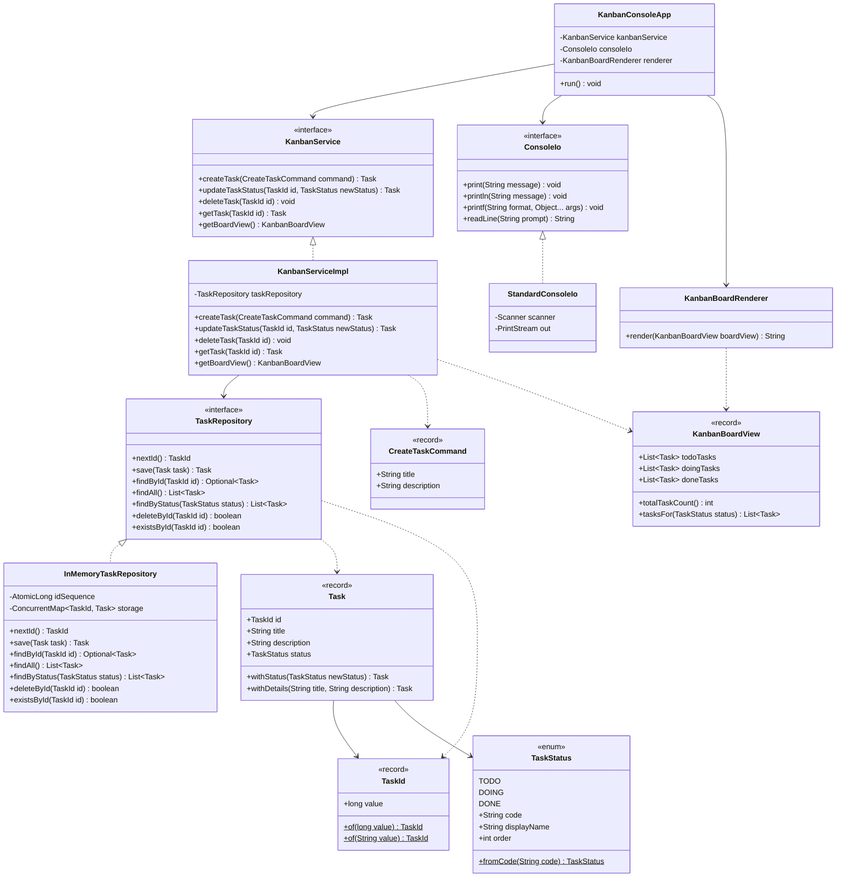
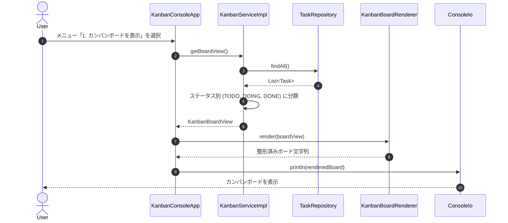
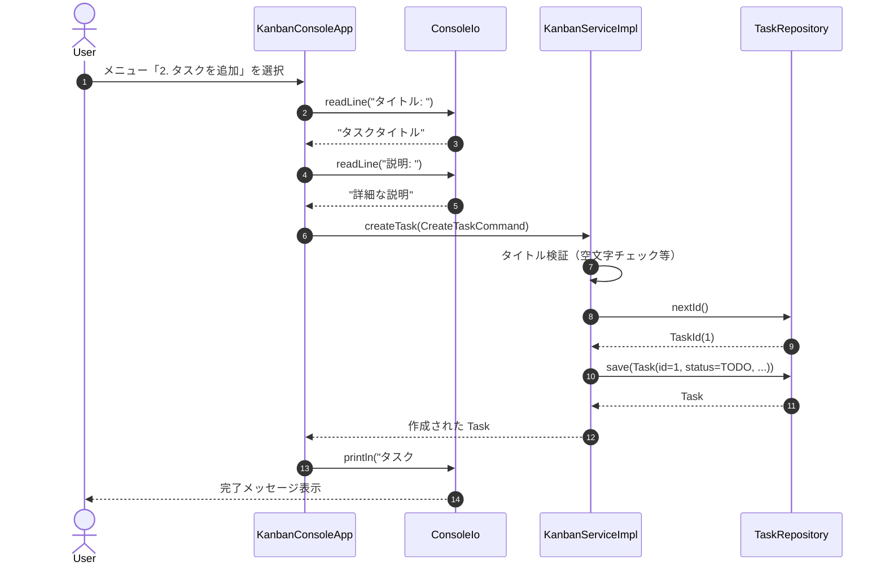
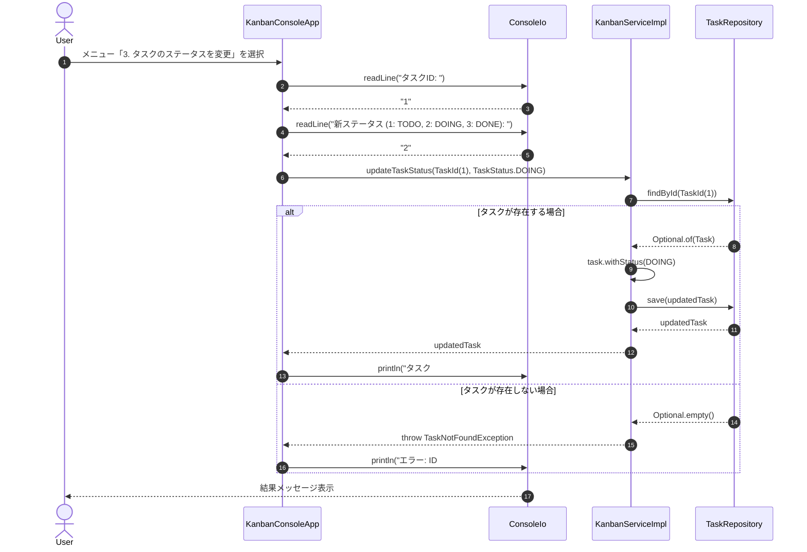

# アーキテクチャ設計書 (カンバンボード コンソールアプリ)

## 1. 設計概要

本ドキュメントは、要件定義書（`docs/specs/feat/kanban-board-console-app.md`）に基づき、Java 25 および Maven 3.9 環境におけるカンバンボードコンソールアプリケーションのアーキテクチャ設計を定義する。

### 1.1 設計方針
- **Clean Architecture / レイヤードアーキテクチャの適用**:
  - `domain`: 外部依存を持たない純粋な業務ルール、不変モデル（Record / Value Object）、ステータスEnum。
  - `repository`: データアクセス抽象（インターフェース）およびインメモリ実装。
  - `service`: 業務ロジックの調整、ユースケース処理。
  - `presentation` / `ui`: コンソール入出力、メニューハンドリング、ボード描画（Renderer）。
  - `com.example.kanban`: アプリケーションエントリーポイント（`Main`）。
- **Java 25 言語機能の活用**:
  - `record` によるイミュータブルなドメインモデル（`TaskId`, `Task`）の表現。
  - `sealed interface` やパターンマッチング（Switch Pattern Matching）による型の安全性向上。
- **テスタビリティの担保**:
  - コンソール入出力（標準入力・出力）を `ConsoleIo` インターフェースで抽象化し、モックやテスト用入出力クラスへの差し替えを可能にする。
  - リポジトリもインターフェース化し、サービスの単体テストを独立して実施可能にする。
- **JavaDoc の網羅**:
  - すべての公開クラス、インターフェース、レコード、主要メソッドに日本語のJavaDocを付与。

---

## 2. パッケージ構成

```text
com.example.kanban
├── Main.java                          // エントリーポイント
├── domain                             // ドメイン層（ビジネス概念・ルール）
│   ├── model
│   │   ├── TaskId.java               // タスクID値オブジェクト (record)
│   │   ├── TaskStatus.java           // タスクステータスEnum (TODO, DOING, DONE)
│   │   └── Task.java                 // タスクエンティティ (record)
│   └── exception
│       ├── KanbanException.java      // ドメイン基本例外
│       ├── TaskNotFoundException.java// タスク不在例外
│       └── ValidationException.java  // 入力検証エラー例外
├── repository                         // リポジトリ層（永続化抽象・実装）
│   ├── TaskRepository.java           // リポジトリインターフェース
│   └── InMemoryTaskRepository.java   // インメモリリポジトリ実装
├── service                            // サービス層（ユースケース）
│   ├── KanbanService.java            // カンバン操作サービスインターフェース
│   ├── KanbanServiceImpl.java        // サービス実装クラス
│   └── dto
│       ├── CreateTaskCommand.java    // タスク登録コマンド (record)
│       └── KanbanBoardView.java      // ボード表示用集約DTO (record)
└── ui                                 // プレゼンテーション層（コンソールUI）
    ├── io
    │   ├── ConsoleIo.java            // 入出力抽象インターフェース
    │   └── StandardConsoleIo.java    // 標準入出力実装
    ├── render
    │   └── KanbanBoardRenderer.java  // 縦並びボード文字列フォーマッタ
    └── KanbanConsoleApp.java         // 対話型コンソールアプリケーション制御
```

### 2.1 パッケージ構成図 (Mermaid)

```mermaid
graph TD
    subgraph com.example.kanban
        Main["Main"]
    end

    subgraph com.example.kanban.ui
        KanbanConsoleApp["KanbanConsoleApp"]
        KanbanBoardRenderer["KanbanBoardRenderer"]
        subgraph com.example.kanban.ui.io
            ConsoleIo["<<interface>> ConsoleIo"]
            StandardConsoleIo["StandardConsoleIo"]
        end
    end

    subgraph com.example.kanban.service
        KanbanService["<<interface>> KanbanService"]
        KanbanServiceImpl["KanbanServiceImpl"]
        subgraph com.example.kanban.service.dto
            CreateTaskCommand["CreateTaskCommand"]
            KanbanBoardView["KanbanBoardView"]
        end
    end

    subgraph com.example.kanban.repository
        TaskRepository["<<interface>> TaskRepository"]
        InMemoryTaskRepository["InMemoryTaskRepository"]
    end

    subgraph com.example.kanban.domain
        subgraph com.example.kanban.domain.model
            TaskId["TaskId (record)"]
            TaskStatus["TaskStatus (enum)"]
            Task["Task (record)"]
        end
        subgraph com.example.kanban.domain.exception
            KanbanException["KanbanException"]
            TaskNotFoundException["TaskNotFoundException"]
            ValidationException["ValidationException"]
        end
    end

    Main --> KanbanConsoleApp
    Main --> StandardConsoleIo
    Main --> InMemoryTaskRepository
    Main --> KanbanServiceImpl

    KanbanConsoleApp --> ConsoleIo
    KanbanConsoleApp --> KanbanService
    KanbanConsoleApp --> KanbanBoardRenderer
    StandardConsoleIo ..|> ConsoleIo

    KanbanServiceImpl ..|> KanbanService
    KanbanServiceImpl --> TaskRepository
    KanbanServiceImpl --> CreateTaskCommand
    KanbanServiceImpl --> KanbanBoardView
    KanbanServiceImpl --> Task
    KanbanServiceImpl --> TaskId
    KanbanServiceImpl --> TaskStatus

    InMemoryTaskRepository ..|> TaskRepository
    InMemoryTaskRepository --> Task
    InMemoryTaskRepository --> TaskId

    KanbanBoardRenderer --> KanbanBoardView
    KanbanBoardRenderer --> Task
```

---

## 3. クラス設計詳細

### 3.1 Domain Layer (`com.example.kanban.domain`)

#### `TaskId` (Record)
- **パッケージ**: `com.example.kanban.domain.model`
- **責務**: タスクの一意な識別子を表現する値オブジェクト。
- **フィールド**:
  - `long value`: 正の整数値。
- **メソッド**:
  - コンストラクタバリデーション: `value <= 0` の場合は `ValidationException` をスロー。
  - `static TaskId of(long value)`: ファクトリメソッド。
  - `static TaskId of(String value)`: 文字列パース付きファクトリメソッド。

#### `TaskStatus` (Enum)
- **パッケージ**: `com.example.kanban.domain.model`
- **責務**: タスクの進捗ステータスを表現。
- **列挙値**:
  - `TODO("TODO", "未着手", 1)`
  - `DOING("DOING", "進行中", 2)`
  - `DONE("DONE", "完了", 3)`
- **フィールド**:
  - `String code`
  - `String displayName`
  - `int order`
- **メソッド**:
  - `static TaskStatus fromCode(String code)`: コード文字列からEnumへ変換（不正時は `ValidationException`）。

#### `Task` (Record)
- **パッケージ**: `com.example.kanban.domain.model`
- **責務**: カンバン上の1つのタスクを表す不変ドメインエンティティ。
- **フィールド**:
  - `TaskId id`: タスクID
  - `String title`: タイトル（必須・非空）
  - `String description`: 説明（任意・nullの場合は空文字へ正規化）
  - `TaskStatus status`: ステータス（必須）
- **メソッド**:
  - コンストラクタバリデーション: `id`, `title`, `status` の null チェック、`title` の空文字・ブランクチェック。
  - `Task withStatus(TaskStatus newStatus)`: ステータスを変更した新しい `Task` インスタンスを生成。
  - `Task withDetails(String newTitle, String newDescription)`: 内容を変更した新しい `Task` インスタンスを生成。

#### 例外クラス群
- `KanbanException`: 実行時例外 `RuntimeException` を継承した基底例外。
- `TaskNotFoundException`: 指定された `TaskId` のタスクが存在しない場合にスロー。
- `ValidationException`: 入力値が不正な場合にスロー。

---

### 3.2 Repository Layer (`com.example.kanban.repository`)

#### `TaskRepository` (Interface)
- **メソッド**:
  - `TaskId nextId()`: 新しい一意なIDを生成。
  - `Task save(Task task)`: タスクを保存（新規作成または更新）。
  - `Optional<Task> findById(TaskId id)`: IDによるタスク検索。
  - `List<Task> findAll()`: 全タスクの取得。
  - `List<Task> findByStatus(TaskStatus status)`: ステータスによるタスク検索。
  - `boolean deleteById(TaskId id)`: タスクの削除（存在して削除された場合 true）。
  - `boolean existsById(TaskId id)`: 存在確認。

#### `InMemoryTaskRepository` (Class)
- **責務**: `TaskRepository` のスレッドセーフなインメモリ実装。
- **内部構造**:
  - `AtomicLong idSequence`: 自動採番用シーケンス。
  - `ConcurrentMap<TaskId, Task> storage`: タスク格納マップ。

---

### 3.3 Service Layer (`com.example.kanban.service`)

#### `CreateTaskCommand` (Record)
- **フィールド**:
  - `String title`: タスクタイトル
  - `String description`: タスク説明

#### `KanbanBoardView` (Record)
- **責務**: ボード描画に必要なステータス別タスク一覧をまとめた集約DTO。
- **フィールド**:
  - `List<Task> todoTasks`
  - `List<Task> doingTasks`
  - `List<Task> doneTasks`
- **メソッド**:
  - `int totalTaskCount()`: 全タスク件数を返却。
  - `List<Task> tasksFor(TaskStatus status)`: 指定ステータスのタスク一覧を返却。

#### `KanbanService` (Interface) / `KanbanServiceImpl` (Class)
- **メソッド**:
  - `Task createTask(CreateTaskCommand command)`: 新規タスクを登録（初期ステータスは `TODO`）。
  - `Task updateTaskStatus(TaskId id, TaskStatus newStatus)`: ステータスを変更。タスクが存在しない場合は `TaskNotFoundException`。
  - `void deleteTask(TaskId id)`: タスクを削除。タスクが存在しない場合は `TaskNotFoundException`。
  - `Task getTask(TaskId id)`: タスクを1件取得。
  - `KanbanBoardView getBoardView()`: 全タスクをステータス別に分類した `KanbanBoardView` を取得。

---

### 3.4 Presentation / UI Layer (`com.example.kanban.ui`)

#### `ConsoleIo` (Interface) & `StandardConsoleIo` (Class)
- **責務**: コンソール入出力の抽象化によるテスト容易性の向上。
- **メソッド**:
  - `void print(String message)`
  - `void println(String message)`
  - `void printf(String format, Object... args)`
  - `String readLine(String prompt)`

#### `KanbanBoardRenderer` (Class)
- **責務**: `KanbanBoardView` から要件定義書通りの縦並びコンソール文字列を生成するフォーマッタ。
- **メソッド**:
  - `String render(KanbanBoardView boardView)`: 縦並びのヘッダー、各セクション（TODO -> DOING -> DONE）、フッターを組み立てて返却。

#### `KanbanConsoleApp` (Class)
- **責務**: 対話型コンソールループの制御、ユーザー入力パース、エラーハンドリング、サービス呼び出し。
- **メソッド**:
  - `void run()`: メインループの実行。
  - private メソッド群: `showBoard()`, `addTask()`, `changeStatus()`, `deleteTask()`, `showMenu()`.

---

## 4. クラス図 (Mermaid)



---

## 5. シーケンス図 (Mermaid)

### 5.1 カンバンボード表示シーケンス



### 5.2 タスク追加シーケンス



### 5.3 タスクステータス変更シーケンス



---

## 6. 後続エージェント（3-tdd-coder）への実装ガイド

1. **実装順序（TDD推奨順）**:
   - **Step 1: ドメイン層 (`com.example.kanban.domain.*`)**
     - `TaskIdTest` -> `TaskId`
     - `TaskStatusTest` -> `TaskStatus`
     - `TaskTest` -> `Task`
   - **Step 2: リポジトリ層 (`com.example.kanban.repository.*`)**
     - `InMemoryTaskRepositoryTest` -> `InMemoryTaskRepository`
   - **Step 3: サービス層 (`com.example.kanban.service.*`)**
     - `KanbanServiceImplTest` -> `KanbanServiceImpl`, `KanbanBoardView`, `CreateTaskCommand`
   - **Step 4: UI/レンダラー層 (`com.example.kanban.ui.*`)**
     - `KanbanBoardRendererTest` -> `KanbanBoardRenderer`
     - `KanbanConsoleAppTest` (Mock/Fake `ConsoleIo` を利用) -> `KanbanConsoleApp`
   - **Step 5: エントリーポイント (`com.example.kanban.Main`)**
     - `Main` クラス実装と手動/統合検証
2. **留意事項**:
   - 不変性（`record`）の維持と純粋関数の徹底。
   - すべてのクラスおよびパブリックメソッドに適切な日本語 JavaDoc を付与すること。
   - 例外発生時でもコンソールアプリが安全に復帰できるようエラーハンドリングを徹底すること。
